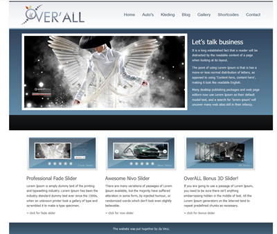

# Over'all Grid
Voor de opdracht van deze week ga je het toegevoegde plaatje (overAll.png) zo exact mogelijk proberen na te maken doormiddel van HTML en CSS. Omdat je het ontwerp zo exact mogelijk probeert na te maken zijn er heel concrete technische eisen, lees deze zorgvuldig door. De gebruikte plaatjes zijn bijgevoegd.

Tevens ga je na het uitwerken van het ontwerp twee nieuwe pagina's maken. Eén pagina met uitleg over de auto's die je bij dit bedrijf kunt bestellen en één pagina met de kleding die ze erbij verkopen.

Het resultaat van je opdracht plaats je uiteraard op GitHub, de link naar de GitHub repository lever je in.

## Functionele eisen:

* De klant kan via zijn browser de webpagina bezoeken van het bedrijf over'All welke exact overeenkomt met het ontwerp.
* De klant kan via het menu de webpagina bezoeken met de auto's die het bedrijf verkoopt.
* De klant kan via het menu de webpagina bezoeken met de kleding die het bedrijf verkoopt.
* De klant kan via een menu tussen de verschillende pagina's navigeren.
 

## Technische eisen:

* Je html en css valideren via https://validator.w3.org/#validate_by_upload
* Je html en css zijn netjes uitgelijnd, gebruik hier de grid voor. (4 rows en per row een aantal kolommen)
* Het gebruikte font is Lato. Dit font is via google beschikbaar https://fonts.google.com/specimen/Lato. Druk rechts op de rode tekst "select this font" voor instructies.
* Je maakt gebruik van een div om gehele pagina te centreren, deze div is 1100px breeed.
* De font size van de normale teksten is 14px en de lijn hoogte 20px.
* De hoofd titel heeft een font size van 26 pixels en een lijn hoogte van 30 pixels.
* Alle andere titels hebben een font size van 20 pixels en een lijn hoogte van 22 pixels. 
*Er staan 3 achtergrond plaatjes in het bijgeleverde bestand, gebruik deze voor de juiste plaats (header_bg, banner_bg en footer_bg) en in de css file.
* Je maakt een net menu (zie voorbeeld) voor elke pagina zodat er genavigeerd kan worden tussen de verschillende pagina's.
* Zorg dat alle pagina's dezelfde look hebben, maar je mag voor de background kleuren (plaatjes) zelf iets maken.
* Zet onderin de footer je eigen naam.
